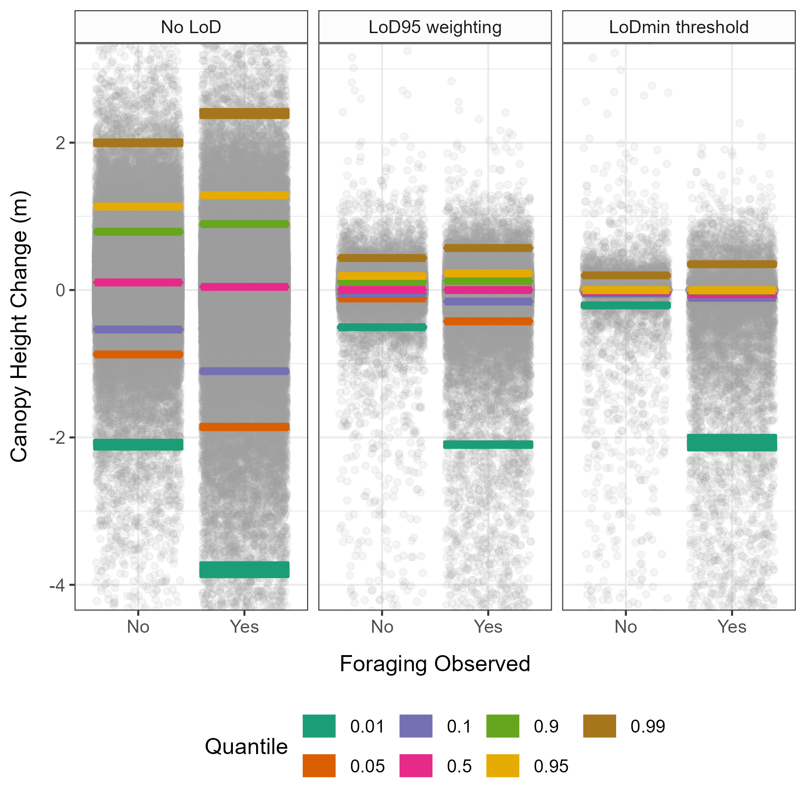

# Beaver Impacts on Riparian Vegetation Structure

This workflow details the analysis of canopy height change data, derived from drone-based SFM surveys. Comparison of three different methods for change detection.

### Area of change detected for each method

### Magnitude of change detected for each method

### Quantile regression used to show change in woodland canopy height at a range of canopy height quantiles.

