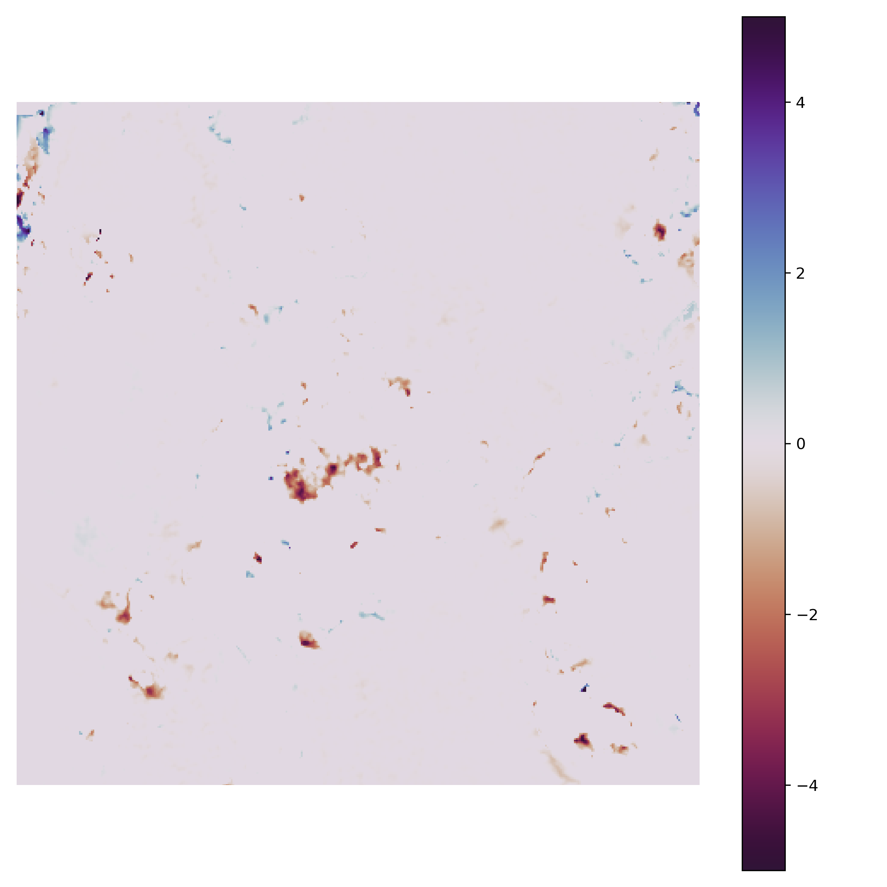

# This Directory contains the XXXXX module

### Name ideas:
PointCloudStat
SFMtoGrid
ConfidentChange
The above aren't great so ideas welcome!
##
### DSM module

The DSM module has one function called'height_map' which allows for the derivation of a Digital Surface Model (DSM) from 
a point cloud. It uses the mean point height (z) within each grid square to define the elevation of the raster cells 
(Band 1). The standard deviation of point elevations is calculated for each grid cell and returned in Band 2.

#### The height_map function is exectued as follows:

`from PointCloudStat.DSM import height_map`

`height_map(point_cloud, out_raster, resolution, window_size=0, epsg=None, bounds=None, mask=None)`

#### Parameters:
**point_cloud**: *str, path object or file-like object*
location of input point cloud. Currently only supported formats are .laz, .las, .txt. 

**out_raster**: *str, path object or file-like object*
The outpath for the DSM raster. .tif file format is recommended as described here: 
https://rasterio.readthedocs.io/en/latest/topics/writing.html

**resolution**: *int, float*
The desired grid resolution for the DSM raster. Only x/y equal grids are supported. 

**window_size**: *int, optional*
'The maximum distance from a donor cell to a target cell when applying the fallback interpolation method. 
See the stage description for more information.' - from https://pdal.io/stages/writers.gdal.html. [Default:0]

**epsg**: *int, optional*
The desired Coordinate Reference System given as an EPSG integer. [Default:None]

**bounds**: *tuple, optional*
tuple with the following form ([xmin, xmax], [ymin, ymax]) defining thedesired bounding box. If None then 
maximum extent is used. [Default:None]

**mask**: *str, path object or file-like object, optional*
A geopandas-readable polygon (http://geopandas.org/io.html). Masks areas as No Data outside the polygon area. If None 
then all data is presented. [Default:None]

#### The function returns a Dsm Class object containing the following attributes:
* rpc - The path of the pointcloud used to create the DSM
* res - The resolution of the raster
* path - the path of the raster file
* wind - the window used to fill no data holes
* bounds - the bounds of the raster - can be used to match other rasters.
* mask - a geopandas readable polygon file to mask an area of interest. (If used)

### PrecisionMap module
The precision_map module has the function precision_map which creates a precision raster from a precision point cloud 
generated with the SFM_Precision module in Metashape. One can make precision rasters of x, y or z dimensions but the
main purpose is to create a z precision raster so we can determine height change maps with accurate limits of detection.

#### The precision_map function is exectued as follows:
`from PointCloudStat.precision_map import precision_map`

`precision_map(prec_point_cloud, out_raster, resolution, prec_dimension=None, epsg=None, bounds=None, 
mask=None)`

#### Parameters:
**prec_point_cloud**: *str, path object or file-like object*
location of input precision point cloud (Created with SFM_Precision). Currently only supported formats are: 
.laz, .las, .txt. 

**out_raster**: *str, path object or file-like object*
The outpath for the Precision raster. .tif (Gtiff) file format is recommended as described here: 
https://rasterio.readthedocs.io/en/latest/topics/writing.html

**resolution**: *int, float*
The desired grid resolution for the DSM raster. Only x/y equal grids are supported. 

**prec_dimension**: *str, optional*
A string of either: 'x', 'y' or 'z'. This defines the dimension of precision to convert to a raster. [Default:'z']

**epsg**: *int, optional*
The desired Coordinate Reference System given as an EPSG integer. [Default:None]

**bounds**: *tuple, optional*
tuple with the following form ([xmin, xmax], [ymin, ymax]) defining thedesired bounding box. If None then 
maximum extent is used. [Default:None]

**mask**: *str, path object or file-like object, optional*
A geopandas-readable polygon (http://geopandas.org/io.html). Masks areas as No Data outside the polygon area. If None 
then all data is presented. [Default:None]

#### The function returns a PrRas Class object containing the following attributes:
* ppc - The path of the pointcloud used to create the DSM
* ras_res - The resolution of the raster
* path - the path of the raster file
* prc_dim - the dimension of precision mapped either (x, y, z)
* wind - the window used to fill no data holes
* bounds - the bounds of the raster - can be used to match other rasters
* mask - a geopandas readable polygon file to mask an area of interest. (If used)

### DEMofDiff module

This module enables the creation of a height change map i.e. Digital Elevation Model(DEM) of difference. Critically,
this module facilitates the use of SFM precision maps and Roughness maps to accurately caluclate the Limit of Detection
(LOD) and therefore if the confidence of any observered changes (insert references).

#### The DEMofDiff function is exectued as follows:

`from PointCloudStat.dem_of_diff import dem_of_diff`

`dem_of_diff(raster_1, raster_2, prec_point_cloud_1, prec_point_cloud_2, out_ras, epsg=None, reg_error=0, t_value=1,
handle_gaps=True ,mask=None)`

#### Parameters:
**raster_1**: *str, path object or file-like object*
The file path for the DSM raster depicting the first time step.

**raster_2**: *str, path object or file-like object*
The file path for the DSM raster depicting the second time step.

**prec_point_cloud_1**: *str, path object or file-like object*
The file path for the Precision raster depicting the first time step.

**prec_point_cloud_2**: *str, path object or file-like object*
The file path for the Precision raster depicting the second time step.

**out_ras**: *str, path object or file-like object*
The out path for the Elevation Change raster (DEM of Difference). .tif (Gtiff) file format is recommended as described here: 
https://rasterio.readthedocs.io/en/latest/topics/writing.html

**epsg**: *int, optional*
The desired Coordinate Reference System given as an EPSG integer. [Default:None]

**reg_error**: *float, optional*
The desired registration error value to be used in the limit of detection (LOD) calculation. [Default:0]

**t_value**: *float, optional*
The desired t value to be used in the LOD calculation. [Default:1]

**handle_gaps**: *Bool, optional*
 If True the Band 1 of the precision raster will be used, in which all no data values are replaced with the maximum 
 recorded precision value. If False then Band 2 is used which forces No data values to be returned in the 
 DEM of difference where gaps in the Precision raster exist. [Default:True]

**mask**: *str, path object or file-like object, optional*
A geopandas-readable polygon (http://geopandas.org/io.html). Masks areas as No Data outside the polygon area. If None 
then all data is presented. [Default:None]

### Plotting module

Now been made - need to add some instructions.

Have a map...
  

####OLD
**Create_Prec_Raster.py** is an example of creating a precision map (raster) from the precision point cloud. NB. this  
cannot be combined into the MetaShape script because the required modules cannot be imported into the Metashape  
environment. Other point2grid approaches could be used for this, and it is essential for users to specify the  
parameters used (e.g. spatial resolution etc.) suitable for their application.

