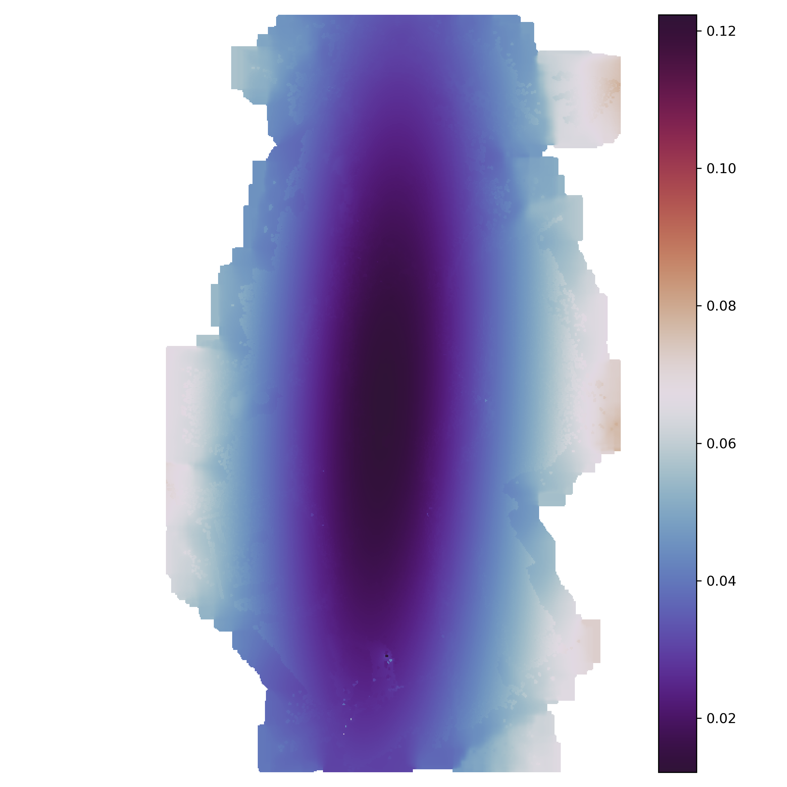
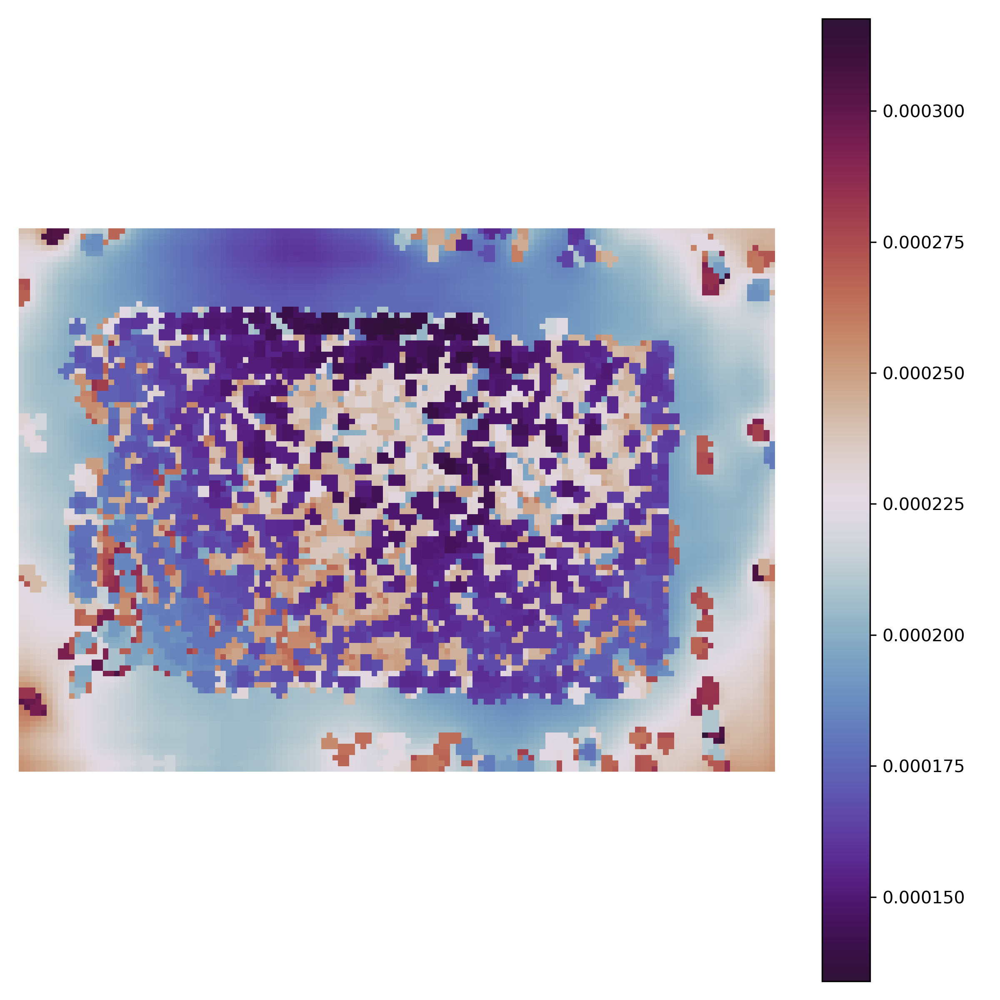

# SFM_Precision
A python workflow to create precision maps with Agisoft Metashape.

(Developed after: James, M., Robson, S., and Smith M. (2017) ‘3-D Uncertainty-Based Topographic Change Detection with  
Structure-from-Motion Photogrammetry: Precision Maps for Ground Control and Directly Georeferenced Surveys’.  
Earth Surface Processes and Landforms 42(12):1769–88. https://doi.org/10.1002/esp.4125).

This module uses Welford's online algorithm to calculate rolling standard deviation of point locations of a sparse cloud  
in Metashape. This approach is space efficient as it does not require the storage of all point clouds. The point cloud is produced entirely in Metashape/python, simplifying the workflow. 
# 
### Dependencies
The SFM Precision Module requires Agisoft Metashape version 1.5.4 (*tested only on Windows*).
The Metashape Python API is used to carry out the repeated randomised camera optimisations.  
This script requires the following external python modules:  
numpy: https://numpy.org/
plyfile: https://github.com/dranjan/python-plyfile  
tqdm: https://tqdm.github.io/  

Install these modules in Metshape's python distributon by running the following (in cmd.exe):      
`"C:\Program Files\Agisoft\Metashape Pro\python\python.exe" -m pip install numpy tqdm plyfile` 

### Installation  

Then, if you want to add this as a module in the Metashape python distribution, just copy SFM_precision.py into this   
folder: "C:\Program Files\Agisoft\Metashape Pro\python\Lib\site-packages". Then the module can be used in custom 
scripts or called directly from the metashape console.  

#
### Run SFM Prcision Analysis

`import SFM_precision`
  
`params = ['fit_f', 'fit_cx', 'fit_cy','fit_b1', 'fit_b2', 'fit_k1',  
'fit_k2', 'fit_k3', 'fit_k4','fit_p1', 'fit_p2', 'fit_p3', 'fit_p4']`
  
`SFM_precision.Run(num_iterations=1000,  
                   params_list=params,  
                   shape_only_Prec=False,    
                   export_log=True)`  
                   
#
#### The following args can be used:
**num_iterations**: (*integer*) The number of Monte Carlo iterations to undertake. James et al., suggest 4000  
&nbsp;&nbsp;&nbsp;&nbsp;&nbsp;&nbsp;&nbsp;&nbsp;&nbsp;&nbsp;&nbsp;&nbsp;&nbsp;&nbsp;&nbsp;&nbsp;&nbsp;&nbsp;&nbsp;&nbsp;&nbsp;&nbsp;&nbsp;
This may take too long for large point clouds in which case 1000 is acceptable.

**params_list**: (*list*) This is a list with desired camera optimization parameters, submitting an empty list returns    
&nbsp;&nbsp;&nbsp;&nbsp;&nbsp;&nbsp;&nbsp;&nbsp;&nbsp;&nbsp;&nbsp;&nbsp;&nbsp;&nbsp;&nbsp;&nbsp;&nbsp;&nbsp;&nbsp;&nbsp;
all params as False. Example above enables all parameters. If no arg is provided  
&nbsp;&nbsp;&nbsp;&nbsp;&nbsp;&nbsp;&nbsp;&nbsp;&nbsp;&nbsp;&nbsp;&nbsp;&nbsp;&nbsp;&nbsp;&nbsp;&nbsp;&nbsp;&nbsp;&nbsp;
then default parameters are selected based on James, et al. 2017.  
                    
**shape_only_Prec**: (*Boolean*) Default is False - if True then a file with observation distances is produced  

**export_log**: (*Boolean*) Default is True - returns a log file containing information on the SFM precision Point  
&nbsp;&nbsp;&nbsp;&nbsp;&nbsp;&nbsp;&nbsp;&nbsp;&nbsp;&nbsp;&nbsp;&nbsp;&nbsp;&nbsp;&nbsp;&nbsp;&nbsp;&nbsp;&nbsp;
Cloud generation.

#
### Description of scripts in repo...
**SFM_precision.py** module based on code published by James et al. 2017, which produces a sparse point cloud of mean   
location and x, y and z precision estimate for each tie point, based on Monte Carlo analysis in Metashape.

**SS/original_precision_estimates.py** is the original python script published by James et al. (with some minor changes  
for running from cmd and testing). Produces a folder with all montecarlo outputs and additional output info  
(some of which is not relevant here...).

**Create_Prec_Raster.py** is an example of creating a precision map (raster) from the precision point cloud. NB. this  
cannot be combined into the MetaShape script because the required modules cannot be imported into the metashape  
environment. Other point2grid approaches could be used for this, and it is essential for users to specify the  
parameters used (e.g. spatial resolution etc.) depending on their application.

**Launch_script.py** is an example launch script for the SFM_precision module

#
#### Example Results...
Here are some examples of z precision maps produced using the point cloud output from this module:  

  
&nbsp;
&nbsp;

&nbsp;
