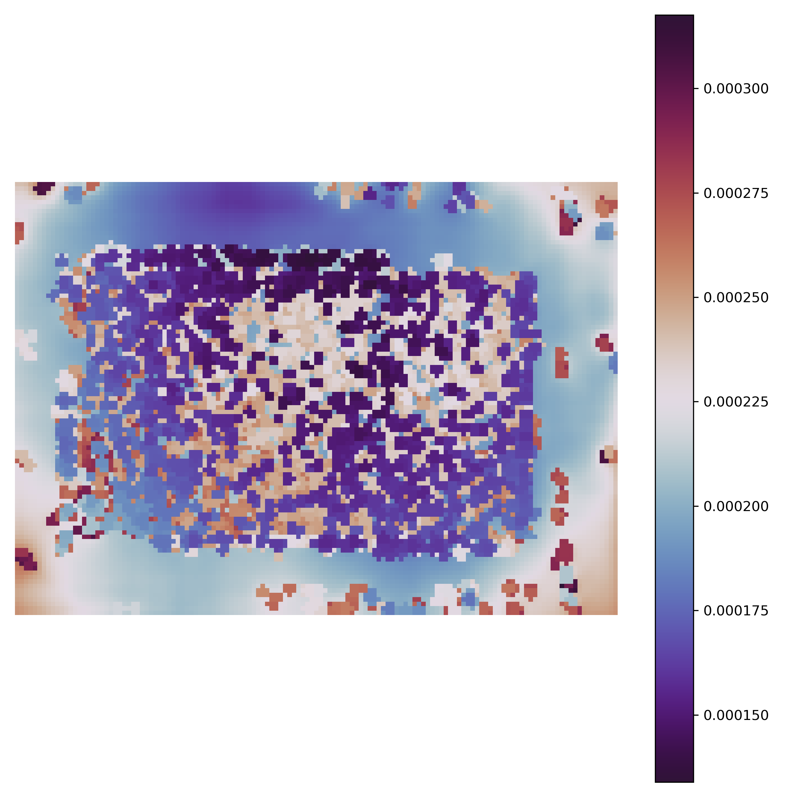

# SFM_Precision
A python workflow to create precision maps with Agisoft MetaShape.

(Developed after: James et al., 2017) ‘3-D Uncertainty-Based Topographic Change Detection with  
Structure-from-Motion Photogrammetry: Precision Maps for Ground Control and Directly Georeferenced Surveys’.  
Earth Surface Processes and Landforms 42(12):1769–88. https://doi.org/10.1002/esp.4125).

This module uses an online algorithm to calculate rolling standard deviation of point locations of a sparse cloud  
in Metashape (Welford, 1962). The point cloud is produced entirely in Metshape/python, simplifying the workflow. This approach is
space efficient as it does not require the storage of all point clouds. 

# 
### Dependencies
The SFM Precision Module requires Agisoft Metashape version 1.5.4 (*tested only on Windows*)
The Metashape Python API is used to carry out the repeated randomised camera optimisations.  
This script requires the following external python modules:  
numpy (1.17.4): https://numpy.org/  
plyfile (0.7.1) : https://github.com/dranjan/python-plyfile  
tqdm (4.40.0): https://tqdm.github.io/  

Install these modules in Metshape's python distribution by running the following (in cmd.exe with administrator permissions):      
`"C:\Program Files\Agisoft\Metashape Pro\python\python.exe" -m pip install numpy tqdm plyfile` 

### Installation  

Then, if you want to add this as a module in the Metashape python distribution, just copy SFM_precision.py into this   
folder: "C:\Program Files\Agisoft\Metashape Pro\python\Lib\site-packages". Then the module can be used in custom 
scripts or called directly from the Metashape console.  

**SFM_precision.py** module based on code published by James et al. 2017, which produces a sparse point cloud of mean   
location and x, y and z precision estimate for each tie point, based on Monte Carlo analysis in Metashape.

**Launch_script.py** is an example script for running the SFM_precision module 'headless' from the command line.

#
### Run SFM Precision Analysis

Ensure that the marker accuracy (pix) is set appropriately in the Metashape project. 

Import module

`import SFM_precision`
####  
Create list of desired camera optimisation parameters 

`params = ['fit_f', 'fit_cx', 'fit_cy','fit_b1', 'fit_b2', 'fit_k1',  
'fit_k2', 'fit_k3', 'fit_k4','fit_p1', 'fit_p2', 'fit_p3', 'fit_p4']`
####  
Initiate Monte Carlo analysis  
`SFM_precision.Run(num_iterations=1000,  
                   params_list=params,  
                   shape_only_Prec=False,    
                   export_log=True)`  
                  

#### The following args can be used:
**num_iterations**: (*integer*) The number of Monte Carlo iterations to undertake. James et al., suggest 4000  
&nbsp;&nbsp;&nbsp;&nbsp;&nbsp;&nbsp;&nbsp;&nbsp;&nbsp;&nbsp;&nbsp;&nbsp;&nbsp;&nbsp;&nbsp;&nbsp;&nbsp;&nbsp;&nbsp;&nbsp;&nbsp;&nbsp;&nbsp;
This may take too long for large point clouds in which case 1000 may be acceptable.

**params_list**: (*list*) This is a list with desired camera optimization parameters, submitting an empty list returns    
&nbsp;&nbsp;&nbsp;&nbsp;&nbsp;&nbsp;&nbsp;&nbsp;&nbsp;&nbsp;&nbsp;&nbsp;&nbsp;&nbsp;&nbsp;&nbsp;&nbsp;&nbsp;&nbsp;&nbsp;
all params as False. Example above enables all parameters. If no arg is provided  
&nbsp;&nbsp;&nbsp;&nbsp;&nbsp;&nbsp;&nbsp;&nbsp;&nbsp;&nbsp;&nbsp;&nbsp;&nbsp;&nbsp;&nbsp;&nbsp;&nbsp;&nbsp;&nbsp;&nbsp;
then default parameters are selected based on James et al., 2017 (i.e. ['fit_f', 'fit_cx', 'fit_cy','fit_b1',
&nbsp;&nbsp;&nbsp;&nbsp;&nbsp;&nbsp;&nbsp;&nbsp;&nbsp;&nbsp;&nbsp;&nbsp;&nbsp;&nbsp;&nbsp;&nbsp;&nbsp;&nbsp;&nbsp;&nbsp; 
'fit_b2', 'fit_k1', 'fit_k2','fit_p1', 'fit_p2']).  
                    
**shape_only_Prec**: (*Boolean*) Default is False - if True then a file with observation distances is produced  

**export_log**: (*Boolean*) Default is True - returns a log file containing information on the SFM precision Point  
&nbsp;&nbsp;&nbsp;&nbsp;&nbsp;&nbsp;&nbsp;&nbsp;&nbsp;&nbsp;&nbsp;&nbsp;&nbsp;&nbsp;&nbsp;&nbsp;&nbsp;&nbsp;&nbsp;
Cloud generation.

#
#### Example Results
Here are some examples of z precision maps produced using the point cloud output from this module:  

  
&nbsp;
&nbsp;

&nbsp;

#
#### References
James, M., Robson, S., and Smith M (2017) ‘3-D Uncertainty-Based Topographic Change Detection with  
Structure-from-Motion Photogrammetry: Precision Maps for Ground Control and Directly Georeferenced Surveys’.  
Earth Surface Processes and Landforms 42(12):1769–88. https://doi.org/10.1002/esp.4125).

Welford, B. P. (1962) 'Note on a method for calculating corrected sums of squares and products'. Technometrics. 4 (3): 419–420. doi:10.2307/1266577. JSTOR 1266577.
