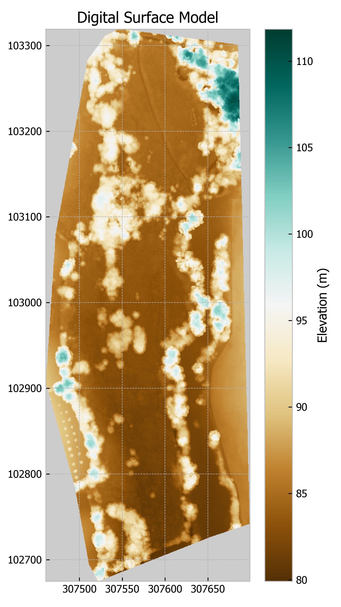
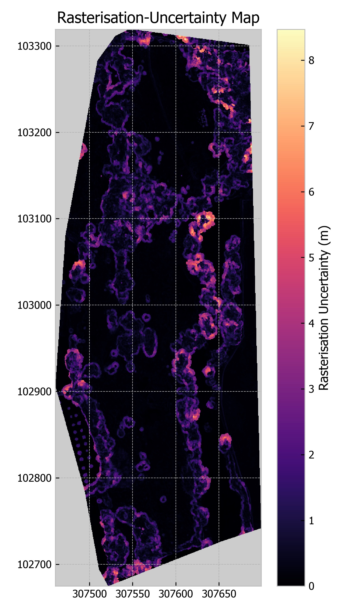
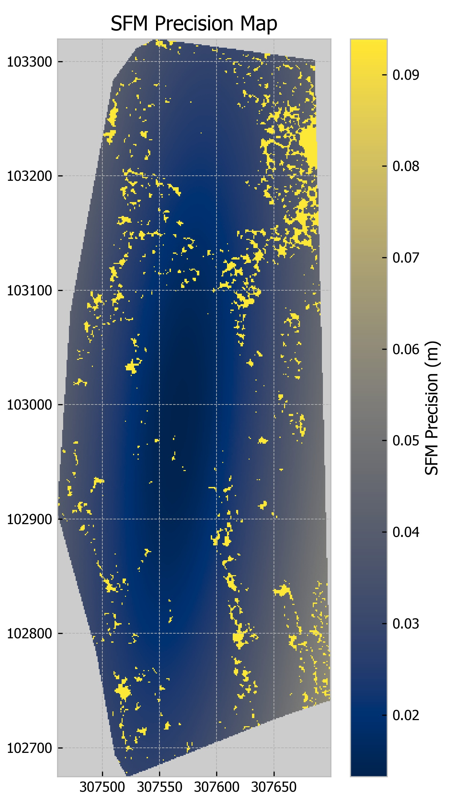

# sfm_gridz

The sfm_gridz package is designed to provide a set a of tools that streamline the processing of SFM point cloud data to
raster products. This model is designed to work alongside the sfm_precision module which derives precision pointclouds 
from an Agisoft Metashape project. Digital Surface Models, Precision maps and Height change maps can be produced 
ensuring that spatially explicit sfm-precision and rasterisation error are considered.

# 
### Dependencies

*pdal* (2.2.1): https://pdal.io/  
*rasterio* (1.1.1): https://rasterio.readthedocs.io/en/latest/index.html  
*numpy* (1.17.3): https://numpy.org/   
*geopandas* (0.6.2): http://geopandas.org/index.html  

### Installation

For the time being... copy the sfm_precision package to the Lib\site-packages directory of your python environment.

**Import package**:

`import sfm_gridz`

### DSM module

The DSM module has one function called'height_map' which allows for the derivation of a Digital Surface Model (DSM) from 
a point cloud. It uses the mean point height (z) within each grid square to define the elevation of the raster cells 
(Band 1). The standard deviation of point elevations is calculated for each grid cell and returned in Band 2.

#### The height_map function is exectued as follows:

`sfm_gridz.dsm(point_cloud, out_raster, resolution, window_size=0, epsg=None, bounds=None, mask=None)`

#### Parameters:
**point_cloud**: *str, path object or file-like object*
location of input point cloud. Currently only supported formats are .laz, .las, .txt. 

**out_raster**: *str, path object or file-like object*
The outpath for the DSM raster. .tif file format is recommended as described here: 
https://rasterio.readthedocs.io/en/latest/topics/writing.html

**resolution**: *int, float*
The desired grid resolution for the DSM raster. Only x/y equal grids are supported. 

**window_size**: *int, optional*
'The maximum distance from a donor cell to a target cell when applying the fallback interpolation method. 
See the stage description for more information.' - from https://pdal.io/stages/writers.gdal.html. [Default:0]

**epsg**: *int, optional*
The desired Coordinate Reference System given as an EPSG integer. [Default:None]

**bounds**: *tuple, optional*
tuple with the following form ([xmin, xmax], [ymin, ymax]) defining thedesired bounding box. If None then 
maximum extent is used. [Default:None]

**mask**: *str, path object or file-like object, optional*
A geopandas-readable polygon (http://geopandas.org/io.html). Masks areas as No Data outside the polygon area. If None 
then all data is presented. [Default:None]

#### The function returns a Dsm Class object containing the following attributes:
* rpc - The path of the pointcloud used to create the DSM
* res - The resolution of the raster
* path - the path of the raster file
* wind - the window used to fill no data holes
* bounds - the bounds of the raster - can be used to match other rasters.
* mask - a geopandas readable polygon file to mask an area of interest. (If used)

### PrecisionMap module
The precision_map module has the function precision_map which creates a precision raster from a precision point cloud 
generated with the SFM_Precision module in Metashape. One can make precision rasters of x, y or z dimensions but the
main purpose is to create a z precision raster so we can determine height change maps with accurate limits of detection.

#### The precision_map function is exectued as follows:

`sfm_gridz.precision(prec_point_cloud, out_raster, resolution, prec_dimension=None, epsg=None, bounds=None, 
mask=None)`

#### Parameters:
**prec_point_cloud**: *str, path object or file-like object*
location of input precision point cloud (Created with SFM_Precision). Currently only supported formats are: 
.laz, .las, .txt. 

**out_raster**: *str, path object or file-like object*
The outpath for the Precision raster. .tif (Gtiff) file format is recommended as described here: 
https://rasterio.readthedocs.io/en/latest/topics/writing.html

**resolution**: *int, float*
The desired grid resolution for the DSM raster. Only x/y equal grids are supported. 

**prec_dimension**: *str, optional*
A string of either: 'x', 'y' or 'z'. This defines the dimension of precision to convert to a raster. [Default:'z']

**epsg**: *int, optional*
The desired Coordinate Reference System given as an EPSG integer. [Default:None]

**bounds**: *tuple, optional*
tuple with the following form ([xmin, xmax], [ymin, ymax]) defining thedesired bounding box. If None then 
maximum extent is used. [Default:None]

**mask**: *str, path object or file-like object, optional*
A geopandas-readable polygon (http://geopandas.org/io.html). Masks areas as No Data outside the polygon area. If None 
then all data is presented. [Default:None]

#### The function returns a PrRas Class object containing the following attributes:
* ppc - The path of the pointcloud used to create the DSM
* ras_res - The resolution of the raster
* path - the path of the raster file
* prc_dim - the dimension of precision mapped either (x, y, z)
* wind - the window used to fill no data holes
* bounds - the bounds of the raster - can be used to match other rasters
* mask - a geopandas readable polygon file to mask an area of interest. (If used)

### DEMofDiff module

This module enables the creation of a height change map i.e. Digital Elevation Model(DEM) of difference. Critically,
this module facilitates the use of SFM precision maps and Roughness maps to accurately caluclate the Limit of Detection
(LOD) and therefore if the confidence of any observered changes (insert references).

#### The DEMofDiff function is exectued as follows:

`sfm_gridz.difference(raster_1, raster_2, prec_point_cloud_1, prec_point_cloud_2, out_ras, epsg=None, reg_error=0, t_value=1,
handle_gaps=True ,mask=None)`

#### Parameters:
**raster_1**: *str, path object or file-like object*
The file path for the DSM raster depicting the first time step.

**raster_2**: *str, path object or file-like object*
The file path for the DSM raster depicting the second time step.

**prec_point_cloud_1**: *str, path object or file-like object*
The file path for the Precision raster depicting the first time step.

**prec_point_cloud_2**: *str, path object or file-like object*
The file path for the Precision raster depicting the second time step.

**out_ras**: *str, path object or file-like object*
The out path for the Elevation Change raster (DEM of Difference). .tif (Gtiff) file format is recommended as described here: 
https://rasterio.readthedocs.io/en/latest/topics/writing.html

**epsg**: *int, optional*
The desired Coordinate Reference System given as an EPSG integer. [Default:None]

**reg_error**: *float, optional*
The desired registration error value to be used in the limit of detection (LOD) calculation. [Default:0]

**t_value**: *float, optional*
The desired t value to be used in the LOD calculation. [Default:1]

**handle_gaps**: *Bool, optional*
 If True the Band 1 of the precision raster will be used, in which all no data values are replaced with the maximum 
 recorded precision value. If False then Band 2 is used which forces No data values to be returned in the 
 DEM of difference where gaps in the Precision raster exist. [Default:True]

**mask**: *str, path object or file-like object, optional*
A geopandas-readable polygon (http://geopandas.org/io.html). Masks areas as No Data outside the polygon area. If None 
then all data is presented. [Default:None]

## sfm_gridz.plot_gridz - plotting module

`from sfm_gridz import plot_gridz`

The sfm_gridz.Plot module contains a number of functions which serve as wrappers for matplotlib. The core functions
are plot_raster and plot_hist. These are generic and can be used but the following functions provide a simpler approach
for plotting specific raster maps and histograms.

#### plot_gridz.plot_dsm

`plot_gridz.plot_dsm(dsm_path, save_path=None, dpi=300, cmap='BrBG', title='Surface Elevation Map', v_range=None, 
colmap_label='Elevation')`

#### Parameters:
**dsm_path**: *str, path object or file-like object*
The file path for the DSM raster to be plotted.

**save_path**: *str, path object or file-like object, optional*
If you want to save a copy of the map to disk then provide a file path including extension e.g. jpeg, png, etc. If None
is provided then the plot will be displayed but not saved. [Default:None]

**dpi**: *int, optional*
The dpi value for the saved image. Only used if save_path is provided. [Default:300]

**cmap**: *str, optional*
A matplotlib colormap string - see here for info (https://matplotlib.org/tutorials/colors/colormaps.html)  
[Default:'BrBG']

**title**: *str, optional*
A string value to add as a title of the plot. [Default:'Surface Elevation Map']

**v_range**: *tuple, optional*
Set limits to the vrtical range of the plot by providing a tuple such as (-5, 5). if None is provided then the 
 maximum and minumum z values will be used to define the colormap. [Default:None]
 
**colmap_label**: *str, optional*
A string value to add as colourmap label. [Default:'Elevation']

  

#### plot_gridz.plot_roughness

`plot_gridz.plot_roughness(dsm_path, save_path=None, dpi=300, cmap='magma', title='Rasterization-Roughness Map', v_range=None,
colmap_label='Rasterisation Uncertainty')`

#### Parameters:
**dsm_path**: *str, path object or file-like object*
The file path for the DSM raster. Roughness data is contained in Band 2 and is automatically selected.

**save_path**: *str, path object or file-like object, optional*
If you want to save a copy of the map to disk then provide a file path including extension e.g. jpeg, png, etc. If None
is provided then the plot will be displayed but not saved. [Default:None]

**dpi**: *int, optional*
The dpi value for the saved image. Only used if save_path is provided. [Default:300]

**cmap**: *str, optional*
A matplotlib colormap string - see here for info (https://matplotlib.org/tutorials/colors/colormaps.html)  
[Default:'magma']

**title**: *str, optional*
A string value to add as a title of the plot. [Default:'Rasterization-Roughness Map']

**v_range**: *tuple, optional*
Set limits to the vrtical range of the plot by providing a tuple such as (-5, 5). if None is provided then the 
 maximum and minumum z values will be used to define the colormap. [Default:None]
 
**colmap_label**: *str, optional*
A string value to add as colourmap label. [Default:'Rasterisation Uncertainty']

  

#### plot_gridz.plot_precision

`plot_gridz.plot_precision(prec_map_path, save_path=None, dpi=300, cmap='cividis', fill_gaps=True, title='SFM Precision Map', 
v_range=None, colmap_label='SFM Precision')`

#### Parameters:
**prec_map_path**: *str, path object or file-like object*
The file path for the Precision raster.

**save_path**: *str, path object or file-like object, optional*
If you want to save a copy of the map to disk then provide a file path including extension e.g. jpeg, png, etc. If None
is provided then the plot will be displayed but not saved. [Default:None]

**dpi**: *int, optional*
The dpi value for the saved image. Only used if save_path is provided. [Default:300]

**cmap**: *str, optional*
A matplotlib colormap string - see here for info (https://matplotlib.org/tutorials/colors/colormaps.html)  
[Default:'cividis]

**fill_gaps:** *Bool, optional*
If True then all gaps in the Precision raster map are filled with the heighest measured precision value. if False gaps
are plotted as no data. [Default:True]

**title**: *str, optional*
A string value to add as a title of the plot. [Default:'SFM Precision Map']

**v_range**: *tuple, optional*
Set limits to the vertical range of the plot by providing a tuple such as (-5, 5). if None is provided then the 
 maximum and minumum z values will be used to define the colormap. [Default:None]
 
**colmap_label**: *str, optional*
A string value to add as colourmap label. [Default:'SFM Precision']

#### plot_gridz.plot_dem_of_diff

`plot_gridz.plot_dem_of_diff(dem_o_diff_path, save_path =None, dpi =300, cmap ='RdBu', title ='Elevation Change Map', v_range=None,
colmap_label='Elevation Change')`

#### Parameters:

**dem_o_diff_path**: *str, path object or file-like object*
The file path for the DEM of Difference raster. 

**save_path**: *str, path object or file-like object, optional*
If you want to save a copy of the map to disk then provide a file path including extension e.g. jpeg, png, etc. If None
is provided then the plot will be displayed but not saved. [Default:None]

**dpi**: *int, optional*
The dpi value for the saved image. Only used if save_path is provided. [Default:300]

**cmap**: *str, optional*
A matplotlib colormap string - see here for info (https://matplotlib.org/tutorials/colors/colormaps.html)  
[Default:'RdBu']

**title**: *str, optional*
A string value to add as a title of the plot. [Default:'Elevation Change Map']

**v_range**: *tuple, optional*
Set limits to the vertical range of the plot by providing a tuple such as (-5, 5). if None is provided then the 
 maximum and minumum z values will be used to define the colormap. [Default:None]
 
**colmap_label**: *str, optional*
A string value to add as colourmap label. [Default:'Elevation Change']

#### plot_gridz.plot_lod
`plot_gridz.plot_lod(dem_o_diff_path, save_path=None, dpi=300, cmap='summer', title='Limit of detection Map', v_range=None,
colmap_label='Limit of Detection')`

**dem_o_diff_path**: *str, path object or file-like object*
The file path for the DEM of Difference raster. LOD data is contained in Band 2 and selected automatically.

**save_path**: *str, path object or file-like object, optional*
If you want to save a copy of the map to disk then provide a file path including extension e.g. jpeg, png, etc. If None
is provided then the plot will be displayed but not saved. [Default:None]

**dpi**: *int, optional*
The dpi value for the saved image. Only used if save_path is provided. [Default:300]

**cmap**: *str, optional*
A matplotlib colormap string - see here for info (https://matplotlib.org/tutorials/colors/colormaps.html)  
[Default:'summer']

**title**: *str, optional*
A string value to add as a title of the plot. [Default:'Limit of detection Map']

**v_range**: *tuple, optional*
Set limits to the vertical range of the plot by providing a tuple such as (-5, 5). if None is provided then the 
 maximum and minumum z values will be used to define the colormap. [Default:None]
 
 **colmap_label**: *str, optional*
A string value to add as colourmap label. [Default:'Limit of Detection']

#### plot_gridz.hist_dsm

`plot_gridz.hist_dsm(dsm_path, save_path=None, dpi=300, colour='green', n_bins=None, density=False, 
title='Digital Surface Model Histogram', xlabel='Elevation', range=None)`

**dsm_path**: *str, path object or file-like object*
The file path for the DSM raster to be plotted as histogram.

**save_path**: *str, path object or file-like object, optional*
If you want to save a copy of the histogram to disk then provide a file path including extension e.g. jpeg, png, etc. 
If None is provided then the plot will be displayed but not saved. [Default:None]

**dpi**: *int, optional*
The dpi value for the saved image. Only used if save_path is provided. [Default:300]

**colour**: *str, optional*
A matplotlib color string - see here for info (https://matplotlib.org/3.1.0/gallery/color/named_colors.html)  
[Default:'green']

**n_bins**: *int, optional*
Number of bins to use for the histogram. If None then matplotlib default bins sizes are used. [Default: None]

**denisty**: *Bool, optional*
If True, y-axis is converted to point density rather than frequency. [Default:False]

**title**: *str, optional*
A string value to add as a title of the plot. [Default:'Digital Surface Model Histogram']
 
**xlabel**: *str, optional*
A string value to add as x-axis label. [Default:'Elevation']

 **range**: *tuple, optional*
Set limits to the range of the histogram by providing a tuple such as (-5, 5). if None is provided then the 
maximum and minumum values will be used to define the colormap. [Default:None]

#### plot_gridz.hist_roughness

`plot_gridz.hist_roughness(dsm_path, save_path=None, dpi=300, colour='red', n_bins=None, density=False, 
title='Surface roughness Histogram', xlabel='Rasterisation Uncertainty', range=None)`

**dsm_path**: *str, path object or file-like object*
The file path for the DSM raster to be plotted as histogram.

**save_path**: *str, path object or file-like object, optional*
If you want to save a copy of the histogram to disk then provide a file path including extension e.g. jpeg, png, etc. If None
is provided then the plot will be displayed but not saved. [Default:None]

**dpi**: *int, optional*
The dpi value for the saved image. Only used if save_path is provided. [Default:300]

**colour**: *str, optional*
A matplotlib color string - see here for info (https://matplotlib.org/3.1.0/gallery/color/named_colors.html)  
[Default:'red']

**n_bins**: *int, optional*
Number of bins to use for the histogram. If None then matplotlib default bins sizes are used. [Default: None]

**denisty**: *Bool, optional*
If True, y-axis is converted to point density rather than frequency. [Default:False]

**title**: *str, optional*
A string value to add as a title of the plot. [Default:'Surface roughness Histogram']

**xlabel**: *str, optional*
A string value to add as x-axis label. [Default:'Rasterisation Uncertainty']

 **range**: *tuple, optional*
Set limits to the range of the histogram by providing a tuple such as (-5, 5). if None is provided then the 
maximum and minumum values will be used to define the colormap. [Default:None]

#### plot_gridz.hist_precision

`plot_gridz.hist_precision(ppc_path, save_path=None, dpi=300, colour='cyan', n_bins=None, density=False, 
title='SFM Precision Histogram', xlabel='x/y/z Precision', range=None)`

**ppc_path**: *str, path object or file-like object*
The file path for precision point cloud file (i.e. the .txt file produced with the 'sfm_precision' module) 
plotted as histogram.

**save_path**: *str, path object or file-like object, optional*
If you want to save a copy of the histogram to disk then provide a file path including extension e.g. jpeg, png, etc. If None
is provided then the plot will be displayed but not saved. [Default:None]

**dpi**: *int, optional*
The dpi value for the saved image. Only used if save_path is provided. [Default:300]

**colour**: *str, optional*
A matplotlib color string - see here for info (https://matplotlib.org/3.1.0/gallery/color/named_colors.html)  
[Default:'cyan']

**n_bins**: *int, optional*
Number of bins to use for the histogram. If None then matplotlib default bins sizes are used. [Default: None]

**denisty**: *Bool, optional*
If True, y-axis is converted to point density rather than frequency. [Default:False]

**title**: *str, optional*
A string value to add as a title of the plot. [Default:'SFM Precision Histogram']

**xlabel**: *str, optional*
A string value to add as x-axis label. [Default:'x/y/z Precision']

 **range**: *tuple, optional*
Set limits to the range of the histogram by providing a tuple such as (-5, 5). if None is provided then the 
maximum and minumum values will be used to define the colormap. [Default:None]

#### plot_gridz.Plot.hist_dem_of_diff

`plot_gridz.hist_dem_of_diff(dem_o_diff_path, save_path=None, dpi=300, colour='magenta', n_bins=None, density=False, 
title='DEM of Difference Histogram', xlabel='Elevation change', range=None')`

**dem_o_diff_path**: *str, path object or file-like object*
The file path for the DEM of difference (height change) raster to be plotted as histogram.

**save_path**: *str, path object or file-like object, optional*
If you want to save a copy of the histogram to disk then provide a file path including extension e.g. jpeg, png, etc. If None
is provided then the plot will be displayed but not saved. [Default:None]

**dpi**: *int, optional*
The dpi value for the saved image. Only used if save_path is provided. [Default:300]

**colour**: *str, optional*
A matplotlib color string - see here for info (https://matplotlib.org/3.1.0/gallery/color/named_colors.html)  
[Default:'magenta']

**n_bins**: *int, optional*
Number of bins to use for the histogram. If None then matplotlib default bins sizes are used. [Default: None]

**denisty**: *Bool, optional*
If True, y-axis is converted to point density rather than frequency. [Default:False]

**title**: *str, optional*
A string value to add as a title of the plot. [Default:'DEM of Difference Histogram']

**xlabel**: *str, optional*
A string value to add as x-axis label. [Default:'Elevation change']

 **range**: *tuple, optional*
Set limits to the range of the histogram by providing a tuple such as (-5, 5). if None is provided then the 
maximum and minumum values will be used to define the colormap. [Default:None]

#### plot_gridz.hist_lod

`plot_gridz.hist_lod(dem_o_diff_path, save_path=None, dpi=300, colour='blue', n_bins=None, density=False, 
title='Limit of Detection Histogram', xlabel='Limit of Detection', range=None')`

**dem_o_diff_path**: *str, path object or file-like object*
The file path for the DEM of difference (height change) raster. LOD saved in band 2 and automatically
selected to be plotted as histogram.

**save_path**: *str, path object or file-like object, optional*
If you want to save a copy of the histogram to disk then provide a file path including extension e.g. jpeg, png, etc. If None
is provided then the plot will be displayed but not saved. [Default:None]

**dpi**: *int, optional*
The dpi value for the saved image. Only used if save_path is provided. [Default:300]

**colour**: *str, optional*
A matplotlib color string - see here for info (https://matplotlib.org/3.1.0/gallery/color/named_colors.html)  
[Default:'blue']

**n_bins**: *int, optional*
Number of bins to use for the histogram. If None then matplotlib default bins sizes are used. [Default: None]

**denisty**: *Bool, optional*
If True, y-axis is converted to point density rather than frequency. [Default:False]

**title**: *str, optional*
A string value to add as a title of the plot. [Default:'Limit of Detection Histogram']

**xlabel**: *str, optional*
A string value to add as x-axis label. [Default:'Limit of Detection']

 **range**: *tuple, optional*
Set limits to the range of the histogram by providing a tuple such as (-5, 5). if None is provided then the 
maximum and minumum values will be used to define the colormap. [Default:None]

Have a map...
  

####OLD
**Create_Prec_Raster.py** is an example of creating a precision map (raster) from the precision point cloud. NB. this  
cannot be combined into the MetaShape script because the required modules cannot be imported into the Metashape  
environment. Other point2grid approaches could be used for this, and it is essential for users to specify the  
parameters used (e.g. spatial resolution etc.) suitable for their application.

